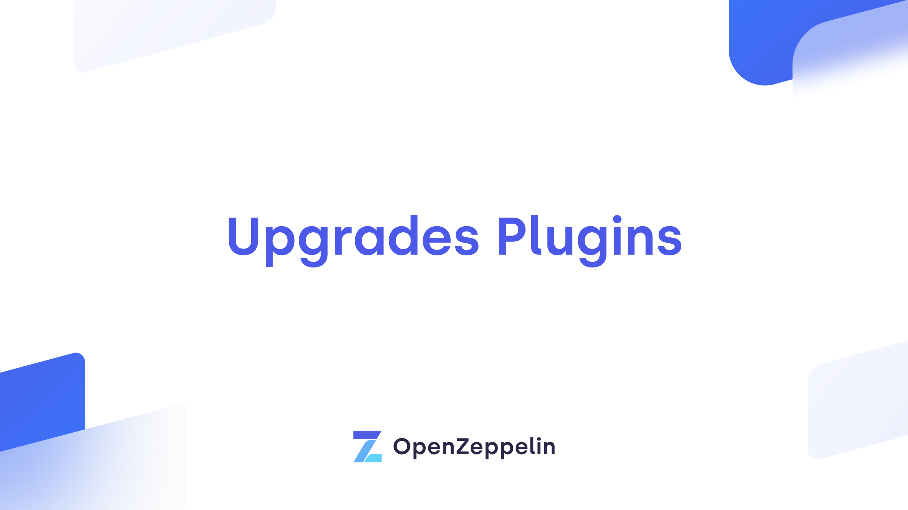
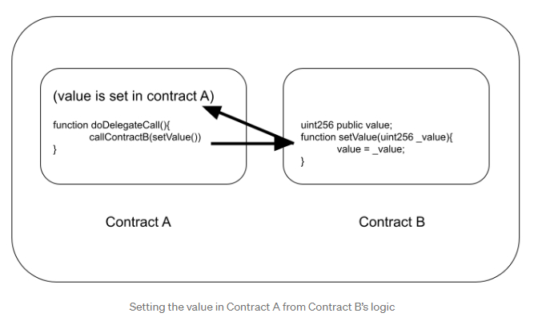

##
## Upgrading Smart Contracts (OpenZeppelin upgrades-plugins)
Resources:<br />
&nbsp;&nbsp;&nbsp;&nbsp;&nbsp;&nbsp;[Better Programming](https://betterprogramming.pub/not-all-smart-contracts-are-immutable-create-upgradable-smart-contracts-e4e933b7b8a9)<br />
&nbsp;&nbsp;&nbsp;&nbsp;&nbsp;&nbsp;[OpenZeppelin Docs](https://docs.openzeppelin.com/upgrades-plugins/1.x/truffle-upgrades)<br />
&nbsp;&nbsp;&nbsp;&nbsp;&nbsp;&nbsp;[OpenZeppelin Blogs](https://blog.openzeppelin.com/the-state-of-smart-contract-upgrades/#diamonds)<br />
##
Topics Covered:
- Upgrading using Transparent Proxy pattern
- Use of OpenZeppelin plugins
- Designating Admin upgrade permissions
- Changing admin account
- Testing upgrades
- Understanding storage & function selector clashes

Cons:
>*However, the transparent pattern has a downside: gas cost. Each call requires an additional read from >storage to load the admin address, which became more expensive after the Istanbul fork last year. Furthermore, the contract itself is expensive to deploy compared to other proxies, at over 700k gas.*

An alternative is to use the UUPS (Universal Upgradeable Proxies).  This put the upgrade logic in the implementation contract.
##

##
## Instructions & Tutorial
1.  Create an initial smart contract (in this example it is Box.sol)
2.  We want to upgrade the contract (at some point in the future) so we use the following package for deployment:
```
'@openzeppelin/truffle-upgrades'
```
3.  We create a deployment script called "2_deploy_upgradeable_box.js".  
4.  We use the deployProxy() function to set our contract which is from the OpenZeppelin package.
6. The parameters include the logic contract, parameter values, deployer address, and initializer function(s)
7.  3 contracts in total are created. The implementation contract, the admin contract, and the proxy contract (created from the admin contract)
8.  Interaction with the implementation contract is done through the proxy. Note: the address of the implmentation contract points to the proxy address
9.  To upgrade, the 3rd migration file needs to be run on its own "3_upgrade_box_contract.js
10. This will point all function calls to the proxy directly to the new contract (BoxV2)
